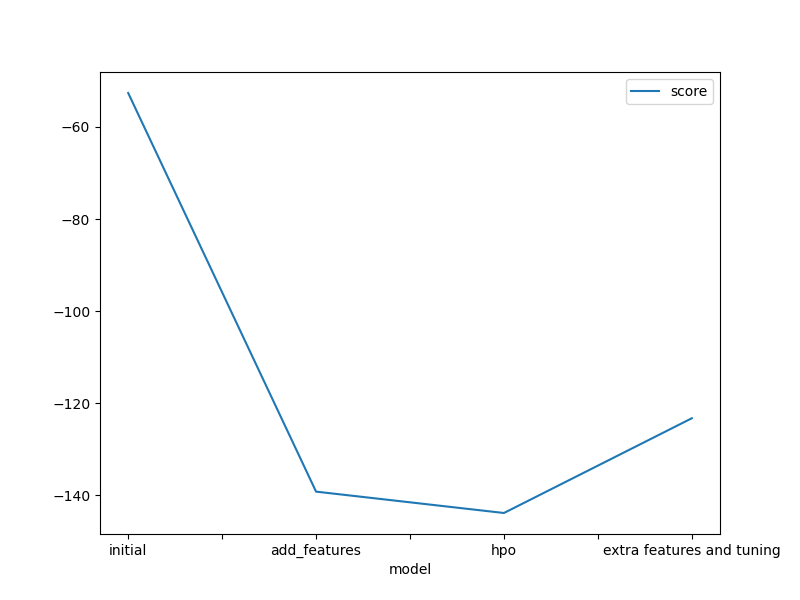

# Report: Predict Bike Sharing Demand with AutoGluon Solution
#### Gurgen Hayrapetyan

## Initial Training
### What did you realize when you tried to submit your predictions? What changes were needed to the output of the predictor to submit your results?

Although none of the predictions in my case were negative, I added code to zero out any negative predictions for any future use of the code.  Since the model is a regression model, the predictions are also real valued, so I round them to the closest integer.

### What was the top ranked model that performed?
As visible from the result of fit_summary command as well as the generated bar chart, the top ranked model was WeightedEnsemble_L3.

## Exploratory data analysis and feature creation
### What did the exploratory analysis find and how did you add additional features?
Certain variables like season and weather should be categorical.  In addition, since the datetime column is in the datetime format, it might make more sense to create separate columns for day, month, and year to improve predictions.  

### How much better did your model preform after adding additional features and why do you think that is?
The improved model resulted in a much better score of 1.32974.  Things like season and weather obviously have a large influence on bike rentals, so I think specifying them correctly as categorical variables had the largest influence.

## Hyper parameter tuning
### How much better did your model preform after trying different hyper parameters?
The model performed slightly better achieving a score of 1.29547. I think since Autogluon already does a pretty good job with hyperparameter search, the manual tweaking of the hyperparameters did not have a drastic effect.  I think the main improvement was due to increasing the time_limit for the auto ml to look for a solution. 

### If you were given more time with this dataset, where do you think you would spend more time?

First, I would do more feature engineering by introducing new categorical variables by bucketing value ranges for various features into categories.  I would also perform dimensional reduction, since the correlation plot shows some correlations between the variables.  It would also be interesting to add some time series analysis to forecast the demand based on the time series data earlier in the day.

### Create a table with the models you ran, the hyperparameters modified, and the kaggle score.
|model|hpo1|hpo2|hpo3|score|
|--|--|--|--|--|
|initial|NA|NA|NA|1.80019|
|add_features|NA|NA|NA|1.32974|
|hpo and tuning NN|time_limit|learning_rate|activation|1.29547|
|extra features and tuning XGBoost|eta|gamma|lambda|1.11318|

### Create a line plot showing the top model score for the three (or more) training runs during the project.

### Create a line plot showing the top kaggle score for the three (or more) prediction submissions during the project.

## Summary
By doing some extra feature engineering and trying various specific models like Neural Networks and XGBoost the score was improved to 1.11318.
